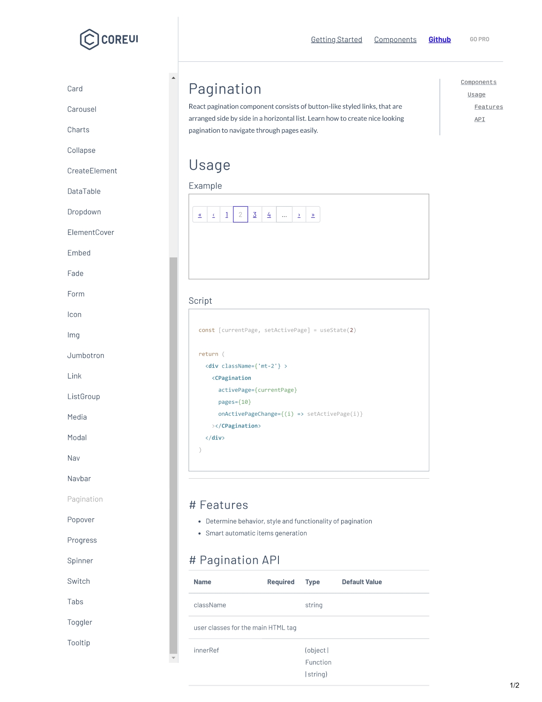
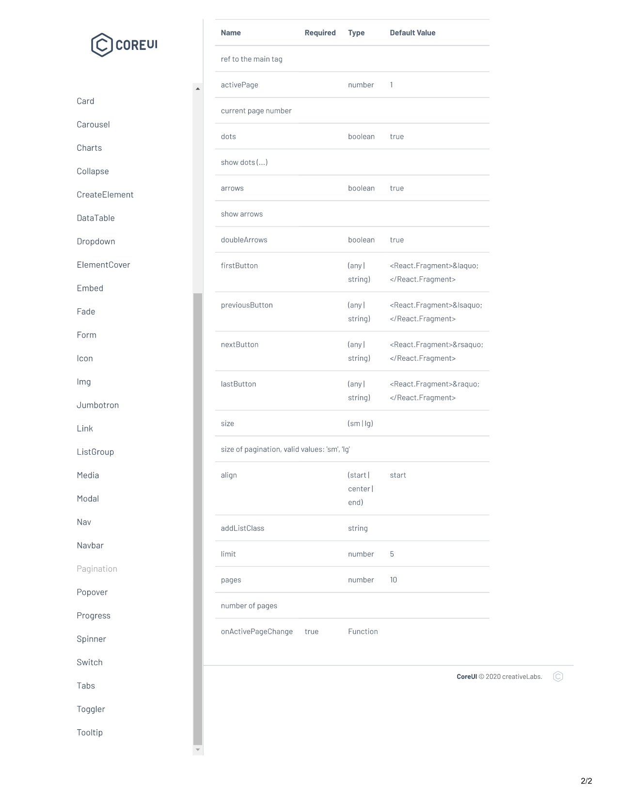

# CssDesignTrail

**Quick Links:**

- 💙See list of website designs here - [Click here](https://docs.google.com/document/d/1zt9YwENq2tRhh4lmTtct6P_fyx7Y-zH2VC5vyUkR4oU/edit?tab=t.0#heading=h.5uug71mi22eb)
- ❤️Using Google Fonts: [1](https://github.com/sahilrajput03/cssDesignTrail/blob/master/04-google-font-with-video/readme.md), [2](https://github.com/sahilrajput03/cssDesignTrail/blob/master/03-google_fonts_example_forked/README.md)
- Learn CSS Animations by Josh M Comeau: [Click here](https://www.joshwcomeau.com/tutorials/animation/) *(Amazing list of posts on animation)*
- The State of CSS 2021: [Click here](https://2021.stateofcss.com/en-US/technologies/css-frameworks/)
- **Css wow:** [Click here](https://codepen.io/cassidoo/)
- **Css Selectors:** [Click here](CSS-Selector-Cheat-Sheet-Dark.pdf)
- **Learn Css Layout:** [Click here](https://csslayout.io/), [Github](https://github.com/1milligram/csslayout)
- **Css Font Stack:** [Click here](https://www.cssfontstack.com/)
- Article:
	- Animation Libraries in Js: [Click here](https://blog.bitsrc.io/11-javascript-animation-libraries-for-2018-9d7ac93a2c59)
- [Ansh Mehra Design Portfolio](https://www.anshmehra.com/)
- **CSS Notes for Professionals:** [Click here](./CSSNotesForProfessionals.pdf)

TODO: [When to use .jpg or .png? the answer is WebP... sort of [ images on the web | part two ]](https://www.youtube.com/watch?v=Z_28syzkv-0)

This is my personal repo for myself, its kinda cheat sheet.

Personal pro tip: Use `run_parcel` binary to run the entire folder at once 🥇︎. [Source](https://github.com/sahilrajput03/my_bin/tree/master/parcel-dev)

Find base css @ https://github.com/sahilrajput03/my_bin/tree/master/snips/css . #base css, #basecss, #startcss, #startercss.

## ❤️ has selector

```css
/* Applies the style to `body` only when an element with
id="my-container" exists anywhere inside it.  */
body:has(#todos-notes) {
	background-color: red;
}

/* ❤️ USED IN FILE - qr-solution-frontend/src/routes/todos/+page.svelte */
/* Very useful in svelte for changing global design for certain pages only */
:global(body:has(#todos-notes)) {
	/* Everything below is inspired directly from telegram. */
	background-image: url(chat-bg-pattern-dark.png);
	background-size: 510px auto;
	background-repeat: repeat;
	background-color: rgb(15, 15, 15);
}
/*
```

## Parallax effect

[w3schools.com](https://www.w3schools.com/howto/howto_css_parallax.asp)

## Give spacing between items in flexbox

Awesome StackOverflow: [Click here](https://stackoverflow.com/questions/20626685/how-do-i-set-distance-between-flexbox-items)

## What select to use in css for a button having class `btn-primary` and `disabled`?

To select a button with the class btn-primary and the disabled attribute in CSS, you can use the following selector:

```css
.btn-primary:disabled {
    /* Your styles here */
}
```

Or, if you're using aria-disabled="true" for accessibility, use this selector:

```css
.btn-primary[aria-disabled="true"] {
    /* Your styles here */
}
```

These selectors apply styles specifically to elements with the btn-primary class that are disabled.

## Should I use `:root` or `html` tag in css to refer to html element? (ChatGPT)

In CSS, both the :root pseudo-class and the html tag can be used to refer to the root element of the document, but they have slightly different use cases and implications:

`:root` Pseudo-Class:

The `:root` pseudo-class matches the root element of the document, which is typically the <html> element in an HTML document. It is often used to define custom properties (variables) because of its higher specificity compared to the `html` selector. This ensures that the custom properties are accessible from anywhere in the CSS, even if there are more specific rules targeting the html element.

Example:

```css
:root {
  --main-color: #3498db;
}

body {
  background-color: var(--main-color);
}
```

`html` Tag selector:

The html tag selector specifically targets the <html> element. It is commonly used for setting global styles, such as font size, line height, and other base styles that are meant to be inherited by all elements.

Example:

```css
html {
  font-size: 16px;
  line-height: 1.5;
}

body {
  font-family: Arial, sans-serif;
}
```

When to Use Which

Use `:root` when defining custom properties (variables) or when you want to ensure higher specificity.
Use `html` for setting base styles that apply to the entire document, especially when inheritance is a key concern.
In most practical scenarios, the choice between the two doesn't affect the outcome much, but using :root is generally considered more semantically correct for defining custom properties.

## Edit any website's text directly in the website

```js
// use this code in browser console
document.designMode = 'on'
```

## Sharing CSS code to share b/w multiple media queries

```ts
  /* Note the comma separated list of media queries which are independent to each other. */
  @media (max-width: ${XL_MEDIA_BREAKPOINT}) and (min-width: ${LG_MEDIA_BREAKPOINT}), (max-width: ${MD_MEDIA_BREAKPOINT}) {
    & {
      flex-direction: column-reverse;
    }
    .text__details {
      padding-inline-start: 0px;
    }
  }
```

## Update/access css variables via javascript

Source: [Stackoverflow answer](https://stackoverflow.com/questions/37801882/how-to-change-css-root-color-variables-in-javascript)


way 1: common way

```js
document.documentElement.style.setProperty('--your-variable', '#YOURCOLOR');
```

way 2: Another cleaner way:

```js
const root = document.querySelector(':root');

// set css variable
root.style.setProperty('--my-color', 'blue');

// to get css variable from :root
const color = getComputedStyle(root).getPropertyValue('--my-color'); // blue
```


way 3: another way

```js
var sheet = document.styleSheets[0];
sheet.insertRule(":root{--blue:#4444FF}");
```

## `root element size` value?

Source of below article text: [Click here](https://www.digitalocean.com/community/tutorials/css-rem-vs-em-units#rem-unit) ~ Suggested by Eric


## Css frameworks?

Source: [Click here](https://2021.stateofcss.com/en-US/technologies/css-frameworks/)


## TODO: Checou this scroll thing

https://twitter.com/argyleink/status/1588201392661204992

## `mantine` css library for react (suggested by Tekena)

Date: 6 Dec, 2022

- Website: [mantine.dev/](https://mantine.dev/), [Github](https://github.com/mantinedev/mantine) (16K*)

## is there && and || operator useful in css?

Tldr: Yes. Source: [Click here](https://stackoverflow.com/questions/2797091/css-and-and-or)


## core-ui pagination

Download coreui admin: [Click here](https://coreui.io/product/free-react-admin-template/)

~Shagun





## style tags can be edited for instant in the browser itself

https://twitter.com/wesbos/status/1586360039174209536

## Remove scroll bar from a page

```css
::-webkit-scrollbar { /* WebKit */
    width: 0;
    height: 0;
}
```

## Abhinav's css skills


## By Ansh Mehra - Awesome Resources

Src: https://www.youtube.com/watch?v=iehzWCm8KHs

1. Case studies of design: growth.design
2. mobbin.design
3. Muzli Plugin  ~Chrome Plugin to show new design on new tabs


~By Ansh Mehra

## Learn styled components

[Click here](learn-styled-components.md)

## Amazing use of negative margins, source: css-tricks

[Click here](https://css-tricks.com/negative-margins/)


## Learn bootstrap

[Click here](learn-bootstrap.md)

## Confetti thing examples (to be done in sahilrajput.ml)

https://www.cssscript.com/tag/confetti/

## Mobile screen sizes

Redmi note5

 	    

## Easiest possible way to center things


## Thats how you divide all the space between the flex items in a flexbox (#2 duplicate)

**Full responsivity -**


## Thats how you divide all the space between the flex items in a flexbox

Source: [css-tricks](https://css-tricks.com/equal-columns-with-flexbox-its-more-complicated-than-you-might-think/)


## Such an amazing property to make some div's content non-wrappable

source: [stackoverflow answer](https://stackoverflow.com/a/4652666/10012446)


## This is such a helpful way to make a flex (say with direction row) to make it take only content's width only


## Make scrollbar take no space / prevent layout shift

Source: https://stackoverflow.com/a/54979559/10012446

```css
html {
    overflow-y: overlay;
}
```

## flex issues faced, i.e., items in a `flex-direction: column` I was not able to center items in horizontally using `align-items: center`

Possible Solution: 1. Make sure the items you want to be centered have to be `block` type else make them block by `display: block` or by `display: inline-block`.

Possible Solution: 2. Make sure you wrap the list of items if you have many in a div so that they get sqeezed to the common width of the div itself and thus will help the issue.

## HTML tags

Browse all html tags @ <https://www.w3schools.com/tags/tag_comment.asp>

```html
<head>
  <meta />
  <title></title>
</head>
<body>
  <main>
    <header>
      <nav></nav>
      <aside></aside>
    </header>

    <section>
      <div>
        <article>
          <h1></h1>
          <p></p>
          
        </article>

        <article>
          <ul>
            <li></li>
            <li></li>
            <li></li>
          </ul>
        </article>

        <hr />
        <br />
        <article>
          <textarea name="" id="" cols="30" rows="10"></textarea>
        </article>

        <pre></pre>

        <b>bold</b>
        <u>underline</u>
        <i>italics</i>

        <a href="#"></a>
        <code> </code>
        <label for=""></label>
        <caption></caption>
        <blockquotes></blockquotes>
      </div>
    </section>

    <footer></footer>
  </main>
</body>
```

**Tips**:

Install `parcel` via

```bash
npm i -g parcel-bundler
```

- Use `live-server` command on terminal to serve this whole directory. But with live-server you don't get hot-reload for css(though live-server does a whole page reload instead which makes scroll position lost on each change in css), so use `parcel index.html` in a particular directory to enable hot reload for css, yikes!
- Use `lsr` or `pd` to use live-server or parcel aliases from my_bin directly.

## FAQ's

### width property on img

The width property say 20% on img tag means that img size will be 20% of its 🧿︎ own 🧿︎ original size(not the container).

### What all do i know in plain css ??

Use command `live-server` to serve the whole project and navigate to different directories to view them.

- Want a color theme: <https://coolors.co/generate> ~ 🛌︎ sleeper.

### What is `:root` and why do we use it?

`:root` css selector has the highest specificity, and we use it define global things, it could be vars or css properties. Also, using `:root` selector is just same as using `html` selector.

### What is `*` and why do we use it?

`*` is a universal selector that selects every css element, yo!

### Want to make font sizes custom for different sizes of devices, just use css vars for that

Source, timestamped in yt video [here](https://youtu.be/ykn4XNDwW7Q?t=1212).

### What is that called when you encounter a unnecessary out of window to scroll horizontally.?

Side scrolling bug.

### Specificity

Learn about specificity [here](https://www.youtube.com/watch?v=c0kfcP_nD9E&ab_channel=KevinPowell), amazing exaplanation about inline style, internal css, external style sheets,
and what now, say: classes or id or selector(say (div p p)) or `!important`, this vid is all you need to know about specificity.

### Tip: Use colors with hash

```bash
#000 black
#111
...
#999
#aaa
...
#eee
#fff white
* All in-between shades are grey shades.

```

### Depressed of calculating actual width of a HTML element via formula `actual-width= (width+2*padding+2*margin)` and `actual-height= (height+2*padding+2*margin)` , so use border-box from now

[source](https://youtu.be/WlGQdgy-M6w).

#### Way 1

```css
*,
*::before,
*::after {
  box-sizing: border-box;
}
```

#### Way 2

- The benefit of using below code way `i.e., inherit way` is that all lower elements of a element that you define with `box-sizing: content-box;` explicitly to be able to use that,
  then all the children elements in that would use that too, as with universal selector we are saying to all elements to just inherit from its parent in the hierarchy. Hacky, isn't
  it..? If you feel its Hacky, simply use the **Way 1** though.

```css
*,
*::before,
*::after {
  box-sizing: inherit;
}

html {
  box-sizing: border-box;
}
```

Note: Default value of `box-sizing is content-box`, so you must hate it. :D

### Other things

- Browser fallback(i.e, to make Internet explore work with css variables too. ) - Watch it out here
  [how to fix](https://www.youtube.com/watch?v=kCmL-O2T7DY&ab_channel=KevinPowell). Also, you may use SASS to fix browser fallback pretty nicely as kevin suggets
  [here](https://youtu.be/wI80oS3KLxY), I didn't look at that though..

- Manipulating css variables with js [here](https://www.youtube.com/watch?v=cZ0yt67A7OM&ab_channel=KevinPowell).

- Browse css variables playlist from kevin [here](https://www.youtube.com/playlist?list=PL4-IK0AVhVjOT2KBB5TSbD77OmfHvtqUi).

- Checkout my codesandbox example for cssvars using react(it has the plain html represetation too(i.e., without styled components too)),
  [get it here](https://codesandbox.io/s/css-variables-vs-themeprovider-with-my-custom-bare-popeye-class-addition-j16bc?file=/src/css-vars/vars.css).

## Free ?

Watch video [here](https://youtu.be/KYFwcIRx16g).

## what is rem/em ?

1 em/rem = 16px

## Selectors

### Space selector (~sahil) or Compound selector (~kevin)

```css
/* Selects all direct🔅︎ or indirect🔅︎ `a` tags children of `nav__list` class. */
.nav__list a {
  color: white;
}
```

eg2.

```css
.header h1 {
  color: limegreen;
}
```

### Direct children only

```css
.myclass > p {
  /* ^^ this selects only direct ``p`` children in `.myclass` only. */
  color: beige;
}
```

### Grouping selector

```css
div,
span {
  color: limegreen;
}
```

### General selectors

```css
/* src: https://www.w3schools.com/css/css_selectors.asp */
/* in this example only <p> elements with class="center" will be red and center-aligned: */
p.center {
  text-align: center;
  color: red;
}

/* For debugging... */
debug {
  border: 5px solid deeppink;
}
```

### Combination selector

**eg1**

```css
.col + .col {
  background-color: skyblue;
  /* above will select the second column in two or more `col class` dom elements. */
  margin-left: 100px;
}
```

**eg2**

```css
.split > * + * {
  /* This above selector is adjacent item selector, that means that only second element will be selected. */
  margin-left: 2em;
  /* If i had "> * + * + *" as selector, then the third element will be selected, yo!! */
}
/* implemented in 01-design-with-notes */
```

## Woop.css

```css
/* continue from here: https://youtu.be/bn-DQCifeQQ?t=1772 */
/* units: 5vh = 5 viewport height, 5vw = 5 viewport width. */
/** SHORTHANDS */
/* the keyword e1, e2 means example1, example2, etc. */
.e1-shorthand {
  width: min(90%, 70.5rem);
}
.e1 {
  width: 90%;
  max-width: 70.5rem;
}
/*  */
.e2 {
  margin-bottom: 1rem;
  /* rem basically means equal to the font size, yikes!! */
}
/*  */

/* Notes .. */
/* Notes .. */
/* Notes .. */
/* Notes .. */
/* TODO */
/* look at min-max video of kevin powell now...! */
/* watch the rem video of kevin powell.. */

img {
  /* This sets the width of image to be automatic aligned to 100% of the width of screen, yo!! */
  max-width: 100%;
}

/* ******** */
/* shorthand */
img {
  width: 70%;
  max-width: 600px;
}
img {
  width: min(500px, 70%);
  /* min function basically computed 70% of the available area and check what is minimum i.e., 500px or our calculated 70%. */
  /* This is shorthand of above, yikes!! */
}
/* ****** */
img {
  width: max(500px, 70%);
}
img {
  width: 70%;
  min-width: 500px;
  /* This is shorthand way, yo!! */
}

/* ************ */

img {
  width: min(500px + 10%, 600px);
  /* Note you must have space around `+` otherwise math won't work! */
}
/* ************ */
img {
  width: clamp(200px, 50%, 20rem);
}

img {
  width: 50%;
  /*(test by shrinking the viewport) if 50% of width is less than 200px, then set `width: 200px;` otherwise `width: 50%;` */
  min-width: 200px;
  /*(test by growing the viewport) if 50% of width is greater than 25rem, then set `width: 25rem;` otherwise use `width: 50%;`*/
  max-width: 25rem;
  /* You may also test this via `max-width: 700px;` */
}
```

## em vs. rem

```css
/* 1em = 16px unless the element's parent has a value for that property set. */
/* The interesting thing about em is that it compounds over children(nesting makes the size multiply by the parent and so on.. */
/* Another interesting thing about em is that if setting property for padding/magin/etc. their value gets evaluated using the font-size value of that element if set(otherwise using the value set in parent). */

/* * em is really really good, as it allows us to size margins/paddings automatically proportional to our font-sizes. */
/* more.. */
/* padding: 1em 3em; */
/* more.. */

/*  */

/* 2em=32px */

/* *********************8 */
/* rem stands for root em, yo! */

/*  */

p {
  margin: 2rem;
  /* here, 2rem evaluates by looking what value for font-size we have set for html i.e., html{font-size: ** } */
  /* And that makes rem to be absolute(only relative to html tag), and thats why its good!! */
  /* Though, em is always gets multiplied from the parent's evaluated value(and parent too gets evaluate its value from its parent, and so on..). */
}

/* valid shorthands i.e., without preceiding 0 before the dot. */
p {
  margin: 0.2rem;
}

p {
  margin: 0.2em;
  text-transform: uppercase;
  letter-spacing: 5px;
  /* ^^ This is useful say for a `BUY NOW` button in html. */
}
/* src: amazing video about em and rem from kevin powell: https://www.youtube.com/watch?v=_-aDOAMmDHI */
```

## Is this thing supported in a particular browser

Simply check the browser support by navigating to - <https://caniuse.com/>

## min, max, clamp function in short

sr: <https://www.youtube.com/watch?v=U9VF-4euyRo>

**min function**

Note: Below snippet is way how a min function can be used to calculates width on event of viewport changing.

```css
p {
  width: min(600px, 100%);
  /* ABOVE IS EQUAL TO BELOW TWO LINES.. */
  width: 100%;
  max-width: 600px;
}
```

**max function**

Note: Below snippet is way how a max function can be used to calculates width on event of viewport changing.

```css
p {
  width: max(200px, 100%);
  /* ABOVE IS EQUAL TO BELOW TWO LINES.. */
  width: 100%;
  max-width: 200px;
}
```

**clamp function**

Note: Below snippet is way how a clamp function can be used to calculates width on event of viewport changing.

```css
p {
  width: clamp(200px, 100%, 600px);
  /* ABOVE IS EQUAL TO BELOW THREE LINES.. */
  min-width: 200px;
  width: 100%;
  max-width: 600px;
}
```

## pseudo elements vs. pseduco class

```bash
a:hover
// here hover is pseudo class.

p::before
// here before is pseudo element.
```

`p::before` means that we care creating a pseudo element inside p tag but before all content, and the same applies to `p::after` i.e., we are creating element after all content inside p.

By default pseudo elements are inline elements i.e., they don't take entire line but share line with other elements. You can make them block elements by `display: block`.

The benefit of using pseudo elements is that we don't need extra markup (i.e., to write html) to get some content on page, we can just do this via pseudo elements only, yikes, so
now you don't need to add empty divs to style them in css, yikes!

**NOTE**

pseudo elements on img tag just doesn't work, so don't try doing that(source: kevin powell)-> check why [here (time stamped)](https://youtu.be/zGiirUiWslI?t=319)?

Text in pseudo elments can't be selected by cursor, as mentioned in this [stackoverlow answer](https://stackoverflow.com/a/27392279/10012446).

- Add image using pseudo element like that

```css
p::after {
  content: url(//unsplash.it/200/200);
}
```

- Add open quotes and close quotes to blockquote text like that -

```css
blockquote::before {
  content: open-quote;
  font-size: 2rem;
}

blockquote::after {
  content: close-quote;
  font-size: 2rem;
}
```

## attribute selector

```html
<style>
  p[popeye] {
    background-color: olive;
    /* So this will set color for p tags having property `popeye`, yikes! */
  }
</style>
<p popeye="yipee!">beautiful paragraph.</p>
```

More on attribute selector from **w3school** and **css-tricks**

Better learn it from css-tricks article as it has very concise exaplanation for all the available options for the **attribute selectors**.

Really impressive article, as it has demonstrated some combining the different selectors too.
Article on attribute selector from **css-tricks** [here](https://css-tricks.com/almanac/selectors/a/attribute/) on attribute selector.

**W3school links:**

- <https://www.w3schools.com/cssref/sel_attribute.asp>
- <https://www.w3schools.com/cssref/sel_attribute_value.asp>
- <https://www.w3schools.com/cssref/sel_attribute_value_contains.asp>
- <https://www.w3schools.com/cssref/sel_attribute_value_lang.asp>
- <https://www.w3schools.com/cssref/sel_attr_begin.asp>
- <https://www.w3schools.com/cssref/sel_attr_end.asp>
- <https://www.w3schools.com/cssref/sel_attr_contain.asp>

## what is .75 rem/em

Its just 75% size of the font-size, yikes!

## pseudo class for first-letter designing

Find the example [my codepen here](https://codepen.io/sahilrajput03/pen/NWdMpBp).
Inspired from kevin's [article](https://www.kevinpowell.co/article/first-letter/).

This thing is popularly known as 'drop case' and you may read more about it [here](https://css-tricks.com/snippets/css/drop-caps/) and there they explain some cross-browser way too but from [can-i-use](https://caniuse.com/?search=first-letter) all current browser support this thing at the time.

## Want to make text not wrap at all

Use

```css
p {
  white-space: nowrap;
}
```

## Transition - love

```html
<style>
  span {
    padding: 30px;
    background-color: red;
    transition: background-color ease-out 1000ms, color ease-out 1000ms;
  }

  span:hover {
    background-color: green;
    color: white;
  }
</style>

<span>I am a span text.</span>
```

In above I have defined two transitions i.e., for background-color and color. (\*color applies to text color in css, yo!)

## shorthand - `inset`

NOTE - shorthand - inset: inset is shorthand for top, left, bottom, right properties.

```css
p {
  top: 0;
  bottom: 0;
  left: 0;
  right: 0;
  /* Above and below is equivalent. */
  inset: 0 0 0 0; /* In same fashion as as we follow padding and margin. */

  /* padding/margin */
  /* All below fashion of assigning property work with inset shorthand as well. */
  padding: 1px 2px 3px 4px; /* top right bottom left */
  padding: 5px 15px 10px; /* top left/right bottom */
  padding: 4px 8px; /* top/bottom left/right */
  padding: 10px; /* value applied to all edges */
}
```

Amaing below code samples from mdn docs for inset:

[inset@mdn](https://developer.mozilla.org/en-US/docs/Web/CSS/inset)

```css
/* <length> values */
inset: 10px; /* value applied to all edges */
inset: 4px 8px; /* top/bottom left/right */
inset: 5px 15px 10px; /* top left/right bottom */
inset: 2.4em 3em 3em 3em; /* top right bottom left */

/* <percentage>s of the width (left/right) or height (top/bottom) of the containing block */
inset: 10% 5% 5% 5%;

/* Keyword value */
inset: auto;

/* Global values */
inset: inherit;
inset: initial;
inset: unset;
```

## Read article on transform property and what are the options available. probably on css-tricks...

Learn about all the transform possibilities @ https://www.w3schools.com/css/css3_2dtransforms.asp .

eg.1 transform

```css
p {
  /* transform: scale(1, 1); */
  /* This is default ^^^. Yikes! */
  /* First param is x axis width and second param is y-axis width. */
}
```

In scale if you put like

p {
transform: scale(2, 3);
}

then p is increased by the size of an element (according to the parameters given for the width and height) like two times of its original width, and three times of its original height. AND ITS JUST THE SAME WAY as in general any image resolution thing like first parameter is width and second is height i.e, 200x400 img means 200 width and 400 height, yikes!!

🚵︎🚵︎🚵︎🤺︎🤺︎🤺︎🤺︎🤺︎🥇︎🥇︎🥇︎🥇︎

Watch out my example that I modidifed a little from w3schools's example in the chapter @ https://www.w3schools.com/code/tryit.asp?filename=GR21OP0LEVNP

Note, that I have added transition property to `div#myDiv` so that when i unhover(i.e., the event when you hover a element and after that you take your cursor of the element boundard) you would see it getting it to its original shape(default value: `transform: none`) with a smooth transition too instead of directly getting to its shape without animation🏅︎🏅︎.

CSS 2D Transforms: https://www.w3schools.com/css/css3_2dtransforms.asp
The best and most interesting is when you use skew() and matrix() methods, and those two combines all other transform properties, yikes!!🧶︎🧶︎

CSS 3D Transforms: https://www.w3schools.com/css/css3_3dtransforms.asp

CSS transform Property: https://www.w3schools.com/cssref/css3_pr_transform.asp

### What the heck is matrix in transition .?

```
.class1{
  transform: matrix(1, 0, 0, 1, 0, 0);
  /*The parameters are as follow: matrix(scaleX(),skewY(),skewX(),scaleY(),translateX(),translateY()) */

  /*  1st/4th: scale(width{default: 1},height{default: 1})*/
  /*2nd/3rd: skew(height), skew(width) */
  /* 5th/6th: movement(vertical), movement(horizontal)  */
}
```

## what happens when you have a error in your css (typo)

Check it [here (time-stamped)](https://youtu.be/McC4QkCvbaY?t=92).

## specificity luck

```html
<style>
  .boom .shankar {
    color: aqua;
  }

  .shankar {
    color: red;
    /* This ^^ doesn't work even though it comes later in code coz the `.boom .shankar` selector has higher specificity, yo!! */
  }
</style>
<div class="boom">
  <div class="shankar">I am namah.</div>
</div>
```

## colors

```css
p {
  color: rgba(0, 0, 0, 0.3);
  /* here, 1 means normal, and LOWERING value will LOWER opacity. */
}
```

## center a thing superfast

**via `position:absolute`**

```css
<style>
.centered {
	position: absolute;
	left: 50%;
	top: 50%;
	transform: translate(-50%, -50%);
}
```

**via align-text (for text only)**

```css
p {
  text-align: center;
}
```

**via flexbox**

```css
.my-item {
  display: flex;
  align-items: center;
  justify-content: center;
}
```

**via grid**

```css
.my-item {
  display: grid;
  place-items: center;
  /* ^^ its shorthand for `justify-items: center` and `align-items: center` */
}
```

## Using svg

```html


<!--  -->
<!-- Another 🔽︎ approach -->
<style>
  .my-svg {
    width: 1000px;
  }
</style>


<!-- direct approach -->
<svg></svg>

<!-- svg images are scalable vector graphics, you can scale them infinitely. -->
```

kevin video on svg: <https://youtu.be/ZJSCl6XEdP8>

## sass

**Generate CSS variables with SCSS:**

Source: [Click here](https://sass-lang.com/documentation/breaking-changes/css-vars/)


Sass: Syntactically Awesome Style Sheets

Scss (sass + css), and it supports existing css too, that means your existing css files would be just scss files by renaming to `.scss` files. BUT DRAWBACK OF SCSS is that you still got to use curly braces.
e.g.

```scss
body
  color: red
```

above is not a valid scss but valid sass.

Online sass playground: <https://www.sassmeister.com/>
TIP: Use `Options` to change compilation `scss` to `css` VS. `sass` to `css `.

eg. valid sass

```sass
.nav
    color: red
    background: green
    &__boom
        color: pink
```

You might not get autocompletion things in sass though so feel free to use bare css though🤠︎.

Note you don't need semicolons and braces.

To get emmet working in scss, just do as suggested [here](https://stackoverflow.com/a/65885917/10012446).

For sass, install this [extension](https://marketplace.visualstudio.com/items?itemName=Syler.sass-indented) and you are all done.

Visit the sass-setup-kevin folder to start with sass/scss🚴︎.

[scss cheat sheet here 🐥︎🐥︎](https://dev.to/finallynero/scss-cheatsheet-7g6).

[Read about modules, mixins in scss/sass - They are great, read in docs here](https://sass-lang.com/guide).

My notes: Mixins are basically functions in sass/scss and it makes it easy to execute a piece of code which is usually repeated at lots of places, and the good thing is we can pass values to our functions too, oops i meant to say mixins.

**What is Partials in scss/sass ?**

A partial is a Sass file named with a leading underscore. ~ [Docs](https://sass-lang.com/guide).

Read about **Extend/Inheritance** in sass [Docs](https://sass-lang.com/guide), its amazing!

## collapsing margins shit in css ?

[Watch it here by kevin, 22 April,21](https://youtu.be/qKiz9gdJdr8)

## Want to to give background image to a element with css, watch out

```css
element{
	background-image: url(./my-image.jpg)

}

.my-div{
	<!-- Note: You need to have height and width specified to be able to see the image, also you can quote the url with ' or " or do not quote at all, and either way the url works.
  background-image: url('https://i.picsum.photos/id/642/536/354.jpg?hmac=fsIxfyo75b-oAC-eFF5XxAGUAiN2k5bXddSQc7C4p30');
  height: 200px;
  width: 300px;
}
```

See live demo @: https://codepen.io/sahilrajput03/pen/jOBaLON

### Transition

Wow 🤺︎🤺︎: What a amazing "Try it out" from w3school @ https://www.w3schools.com/css/tryit.asp?filename=trycss3_transition_transform .

Amazing chapter @ w3school, read if you are living life @ https://www.w3schools.com/css/css3_transitions.asp

All transition-timing-functions:

The transition-timing-function property can have the following values:

    ease - specifies a transition effect with a slow start, then fast, then end slowly (this is 🥇︎DEFAULT🥇︎)
    linear - specifies a transition effect with the same speed from start to end
    ease-in - specifies a transition effect with a slow start
    ease-out - specifies a transition effect with a slow end
    ease-in-out - specifies a transition effect with a slow start and end
    cubic-bezier(n,n,n,n) - lets you define your own values in a cubic-bezier function

```css
div {
  transition-property: width;
  transition-duration: 2s;
  transition-timing-function: linear;
  transition-delay: 1s;
}

<!-- Note below is a shorthand of above individual properties 🤺︎🤺︎(src: https://www.w3schools.com/css/css3_transitions.asp). -->

div {
  transition: width 2s linear 1s;
}
```

To see different transition-timing-function in action together, just see it at below codesandbox

Src: https://codesandbox.io/s/amazing-transition-timing-function-f9y2k?file=/src/App.js

Read on awesome info @ https://www.w3schools.com/css/css3_transitions.asp

### Wonder what is media screen

src of below knowledge: https://stackoverflow.com/a/8595600
src of another answer linked in above answer: https://stackoverflow.com/a/14168210
and w3c resource links in ^^ this answer.

Amazing docs from w3school, please read this in whole when in moode: https://www.w3schools.com/css/css_rwd_mediaqueries.asp

```
 @media print {
    body { font-size: 10pt }
  }
  @media screen {
    body { font-size: 13px }
  }
  @media screen, print {
    body { line-height: 1.2 }
  }
```

So in above code, we can see for different type of medias we are defining different rules here.

From reading the docs about media types, some content is like below..

```
7.3 Recognized media types (media queries)

Read the amazing info @w3schools.com @ link: https://www.w3schools.com/cssref/css3_pr_mediaquery.asp

The names chosen for CSS media types reflect target devices for which the relevant properties make sense. In the following list of CSS media types the names of media types are normative, but the descriptions are informative. Likewise, the "Media" field in the description of each property is informative.

all
    Suitable for all devices.
braille
    Intended for braille tactile feedback devices.
embossed
    Intended for paged braille printers.
handheld
    Intended for handheld devices (typically small screen, limited bandwidth).
print
    Intended for paged material and for documents viewed on screen in print preview mode. Please consult the section on paged media for information about formatting issues that are specific to paged media.
projection
    Intended for projected presentations, for example projectors. Please consult the section on paged media for information about formatting issues that are specific to paged media.
screen
    Intended primarily for color computer screens.
speech
    Intended for speech synthesizers. Note: CSS2 had a similar media type called 'aural' for this purpose. See the appendix on aural style sheets for details.
tty
    Intended for media using a fixed-pitch character grid (such as teletypes, terminals, or portable devices with limited display capabilities). Authors should not use pixel units with the "tty" media type.
tv
    Intended for television-type devices (low resolution, color, limited-scrollability screens, sound available).

Media type names are case-insensitive.

Media types are mutually exclusive in the sense that a user agent can only support one media type when rendering a document. However, user agents may use different media types on different canvases. For example, a document may (simultaneously) be shown in 'screen' mode on one canvas and 'print' mode on another canvas.

Note that a multimodal media type is still only one media type. The 'tv' media type, for example, is a multimodal media type that renders both visually and aurally to a single canvas.

@media and @import rules with unknown media types (that are nonetheless valid identifiers) are treated as if the unknown media types are not present. If an @media/@import rule contains a malformed media type (not an identifier) then the statement is invalid.

Note: Media Queries supercedes this error handling.

For example, in the following snippet, the rule on the P element applies in 'screen' mode (even though the '3D' media type is not known).

@media screen, 3D {
  P { color: green; }
}

Note. Future updates of CSS may extend the list of media types. Authors should not rely on media type names that are not yet defined by a CSS specification.
```

src: https://www.w3.org/TR/CSS2/media.html

Also, this particular topic is also interesting: https://www.w3.org/TR/CSS2/media.html#media-groups

Read the whole w3c recommendations @ https://www.w3.org/TR/CSS2/media.html though.

### Why floats exists ?

Simply go to this [codepen by kevin](https://codepen.io/kevinpowell/pen/gzZpGL/), he talks about it in below video 🥰︎.

[Timestamped video of kevin](https://youtu.be/R7gqJkdc5dM?t=253)

Also, he said he got inspired about it via reading this article - [Article on medium](https://medium.com/actualize-network/modern-css-explained-for-dinosaurs-5226febe3525)

### Using transofrm

```css
transform: translate(-50%, -50%);
```

### Using `border`

The border property is a shorthand property for the following individual border properties:

```css
border-width
border-style (required)
border-color
```

src: https://www.w3schools.com/css/css_border_shorthand.asp

```css
.myitem {
  border-top: 2px solid blue;
  border-right: 2px dotted red;
  border-bottom: 2px dotted yellow;
  border-left: 2px solid deeppink;
}
```

## Using `border-radius`

🤺︎ Amazing: src: https://www.w3schools.com/cssref/css3_pr_border-radius.asp

- Four values - border-radius: 15px 50px 30px 5px; (first value applies to top-left corner, second value applies to top-right corner, third value applies to bottom-right corner, and fourth value applies to bottom-left corner).

- Three values - border-radius: 15px 50px 30px; (first value applies to top-left corner, second value applies to top-right and bottom-left corners, and third value applies to bottom-right corner).

- Two values - border-radius: 15px 50px; (first value applies to top-left and bottom-right corners, and the second value applies to top-right and bottom-left corners):

- One value - border-radius: 15px; (the value applies to all four corners, which are rounded equally:

## Outline

Always prefer outline instead of border coz outline doesn't cause existing layout to have sideaffects but border does. So if you are adding outline to any item you are not adding sizing differences to the ui but just adding some thing for debug only practise, yo!

Usage (syntax is same as border):

```css
.twelfth {
  outline: 2px solid deeppink;
}
```

## Directly edit html content in `Elements` tab in browser tools

Use f2 to edit and save directly for fast access, yikes!!

## What is !important?

src: https://www.w3schools.com/css/css_important.asp

Amazing..!!

## What is `initial`, `inherit`, `unset`, `all:initial/inherit/unset` ??

Src: [Kyle's youtube video](https://www.youtube.com/watch?v=N8tFrMZp_wA)

E.g., 1:

Below code will make these divs appear as side by side coz initial value for `display` property is `iniline`.

```txt
<div>div1</div>
<div>div2</div>

div{
  display: initial;
}
```

E.g., 2:

Below code demonstrates that some properties are always inherited like [`font-size`](https://developer.mozilla.org/en-US/docs/Web/CSS/display#formal_definition), [`font-family`](https://developer.mozilla.org/en-US/docs/Web/CSS/font-family#formal_definition) whereas some are never inherited like [`border`](https://developer.mozilla.org/en-US/docs/Web/CSS/border#formal_definition), [`outline`](https://developer.mozilla.org/en-US/docs/Web/CSS/outline#formal_definition),

```txt
<div>
  I am a div.
  <p>I am a paragraph.</p>
</div>
<p class="imp">I am paragraph imp.</p>

div{
  font-size: 2rem;
/*   ^ font-size is inherited in p tag as well. */
  border: 1px solid blue;
/*   ^ border is not inherited unless you specifically explicitly inherit it. */
}

p{
/*   border: inherit; */
}
```

E.g., 3

```txt
button{
 all: unset;
<!--  ^^ This will remove all the browser's and other user defined css for this element, and now all the shit things are purged automatically(and thats what you want mostly for buttons). Yikes!!  -->
 background-color: red;
}
```

E.g., 4: In below example the padding and border property values are set to browser's style sheet for chrome/firefox/etc and below code does nothing coz all the values for all the properties are set to rever by default. `revert` is only useful in cases when you just need to undo your own style property sometimes(which is very rare though).

```
button{
 padding: revert;
 border: revert;
}
```

More information:

```txt
- CSS Property values: initial, inherited,

- You can find default values of each css properties @ mdn in the "Formal definition" section.


- For a ``div`` in all browsers the value for `div` is set as `display: block` but by the css specifications's ``initial`` value for property of ``display`` is ``inline`` as you can read [here](https://developer.mozilla.org/en-US/docs/Web/CSS/display#formal_definition).

You should always use ``font-family: inherit`` in buttons (so they can actually get your custom font) coz otherwise they get font-family property as `Arial` from browser's ``User Agent Stylesheet``.

``display`` property has default value for inherited as false. [Src](https://developer.mozilla.org/en-US/docs/Web/CSS/display#formal_definition).
``border`` property has defaut value for inherited as false. [Src](https://developer.mozilla.org/en-US/docs/Web/CSS/border#formal_definition)
``font-size`` property has default value for inherited as true. (this means any nested child will have the same font-size coz they inherit the font-size of the parent. [Src](https://developer.mozilla.org/en-US/docs/Web/CSS/font-size#formal_definition)

``unset`` as value for a property will make that property to either set as ``inherit`` or ``initial`` where inherit means exactly what it means and ``initial`` means

- Magic: If you set ``all: unset`` in any element in css then all css properties of that selected element will be seet to ``inherit`` or ``initial``,
```

### Some selectors (src: kyle's css selector cheatsheet, find it in your `CSS Resources` telegram group.

#### `:first-child` selector

```
<div>
  <span>I am span 1.</span>
  <span>I am span 2.</span>
  <span>I am span 3.</span>
</div>

span:first-child{
  color: red;
/* Only "I am span 1" will be coloured red. */
}
```

#### `:last-child` selector

```
<div>
  <span>I am span 1.</span>
  <span>I am span 2.</span>
  <span>I am span 3.</span>
</div>

span:last-child{
  color: red;
/* Only "I am span 3" will be coloured red. */
}
```

#### `:nth-child(2n)` selector

```
<div>
  <span>I am span 1.</span>
  <span>I am span 2.</span>
  <span>I am span 3.</span>
  <span>I am span 4.</span>
  <span>I am span 5.</span>
</div>


span:nth-child(2n){
  color: red;
/* Only "I am span 2" and "I am span 4" will be coloured red. */
}

```

#### `:nth-last-child(1)`

```
<div>
  <span>I am span 1.</span>
  <span>I am span 2.</span>
  <span>I am span 3.</span>
</div>

span:nth-last-child(1){
  color: red;
/* Only "I am span 3" will be coloured red. */
}
```

#### `:only-child`

```
<div>
  <span>I am span 1.</span>
  <span>I am span 2.</span>
  <span>I am span 3.</span>
</div>

<div><span>I am single span.</span></div>

span:only-child{
  color: red;
/* Only "I am single span." will be coloured red. */
}
```

#### `a:first-of-type`

```
<div>
  <span>I am span 1.</span>
  <span>I am span 2.</span>
  <span>I am span 3.</span>
</div>

<div>
  <div>I am simple div.</div>
  <span>I am simple span.</span>
</div>

span:first-of-type{
  color: red;
/* Only "I am single span." and "I am span 1." will be coloured red. */
}
```

#### `a:last-of-type`

```
<div>
  <span>I am span 1.</span>
  <span>I am span 2.</span>
  <span>I am span 3.</span>
</div>

<div>
  <div>I am simple div.</div>
  <span>I am simple span.</span>
</div>

span:last-of-type{
  color: red;
/* Only "I am span3." and "I am simple span." will be coloured red. */
}
```

#### `a:nth-of-type(2n)`

```
<div>
  <div>I am span 1.</div>
  <span>I am span 2.</span>
  <span>I am span 3.</span>
</div>

<div>
  <div>I am simple div1.</div>
  <div>I am simple div2.</div>
  <span>I am simple span1.</span>
  <span>I am simple span2.</span>
</div>


span:nth-of-type(2n){
  color: red;
/* Only "I am span3." and "I am simple span2." will be coloured red. */
}
```

#### `:nth-last-of-type(2)`

```
<div>
  <div>I am span 1.</div>
  <span>I am span 2.</span>
  <span>I am span 3.</span>
</div>

<div>
  <div>I am simple div1.</div>
  <div>I am simple div2.</div>
  <span>I am simple span1.</span>
  <span>I am simple span2.</span>
</div>

span:nth-last-of-type(2){
  color: red;
/* Only "I am span2." and "I am simple span1." will be coloured red. */
}
```

#### `a:only-of-type`

```
<div>
  <div>I am div 1.</div>
  <div>I am div 2.</div>
  <span>I am span 1.</span>
  <div>I am div 3.</div>
</div>

<div>
  <div>I am simple div1.</div>
  <div>I am simple div2.</div>
  <span>I am simple span1.</span>
  <span>I am simple span2.</span>
</div>

span:only-of-type{
  color: red;
/* Only "I am span1." will be coloured red. */
}
```

#### `a:not(.c)`

```
<div>
  <span class='c1'>I am span 1.</span>
  <span class='c2'>I am span 2.</span>
  <span class='c3'>I am span 3.</span>
  <span class='c2 c3'>I am span 4.</span>
</div>

span:not(.c2){
  color: red;
/* Only "I am span1." will be coloured red. */
}
```

### Ease with Dates

Date() and Date.now() gives you:

```
"Mon Aug 23 2021 18:49:44 GMT+0530 (India Standard Time)" and 1629724786923 respectively.
```
