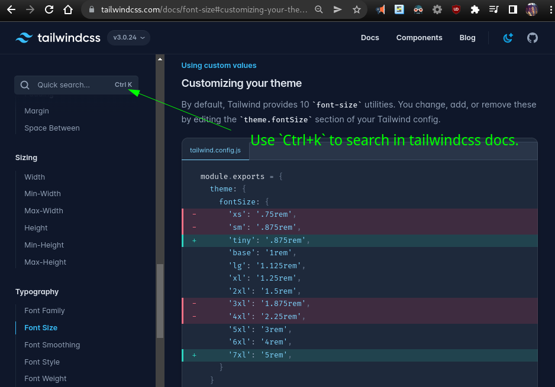
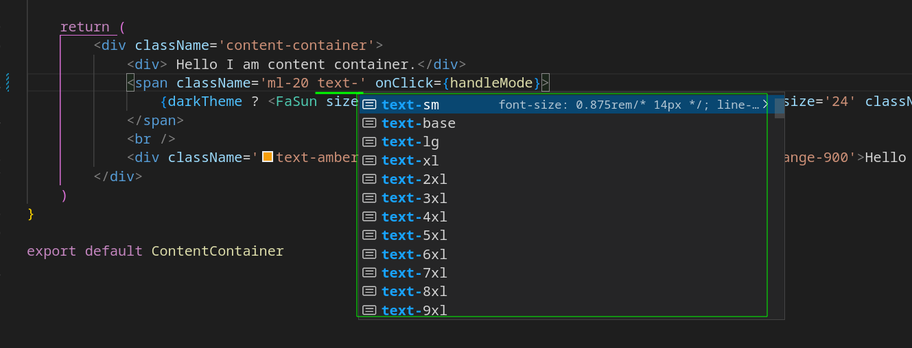
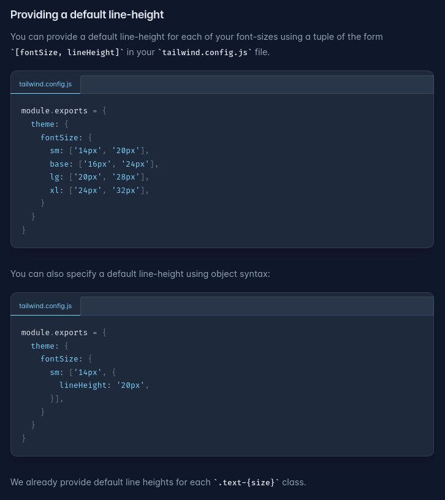
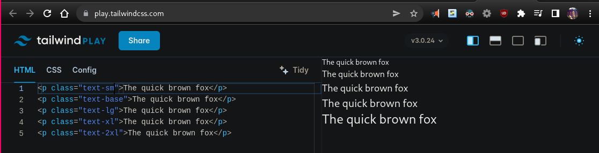
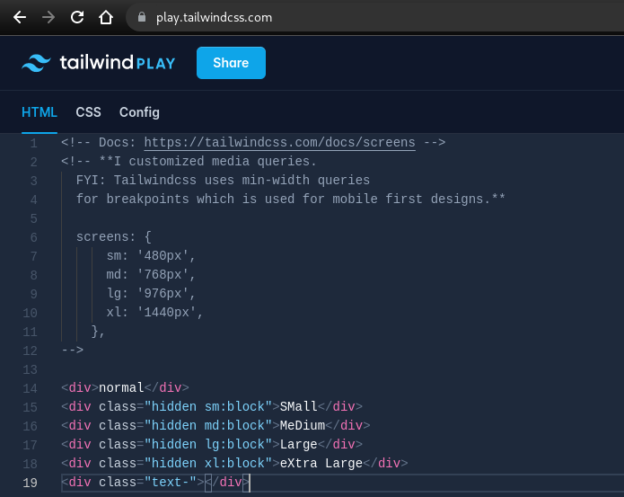
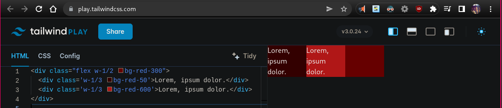
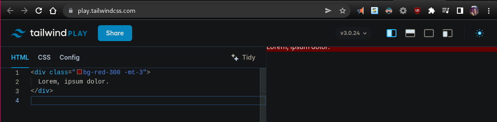
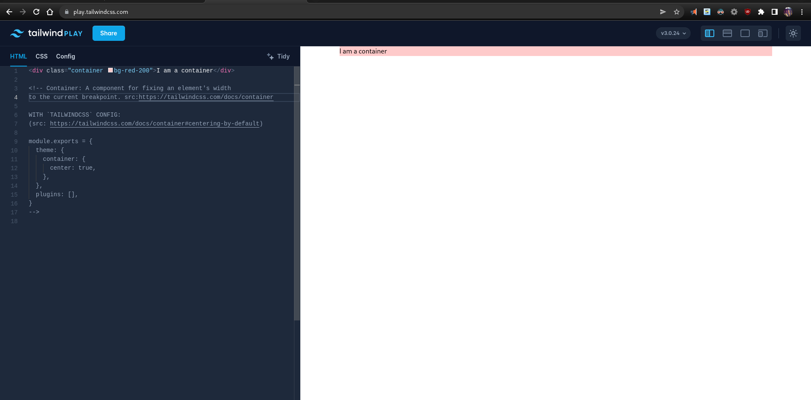

# README

Related Libs: Headless UI, [Daisyui](https://daisyui.com/) [gitub 14.6*](https://github.com/saadeghi/daisyui)

Play with tailwindcss: https://play.tailwindcss.com/

Setting up `tailwindcss` is now easiest: https://tailwindcss.com/docs/guides/create-react-app .

- Motivation: https://youtu.be/pfaSUYaSgRo

- Github code of fireshipio: https://github.com/fireship-io/tailwind-dashboard

- Tailwind Crash Course | Project From Scratch by Traversy media [@ youtube](https://youtu.be/dFgzHOX84xQ), [Code here](https://github.com/bradtraversy/tailwind-landing-page)

```bash
# Some Common classes
text-3xl bg-blue-300 text-black font-bold
text-pink-400
```

## In vanilla js project

- Watch with tailwindcss: `tailwindcss -w -i ./static/src/main.css -o ./static/dist/main.css --minify` (-w is for watch mode).

## Official good reference pages

- [Forms with Tailwind](https://v1.tailwindcss.com/components/forms)
- 50% width: `w-1/2`

## AMZ Images:

**_Bcoz images are worth a thousand words!_**

- **Searching docs:** 

- **Variety of font sizes:** 

- **Font sizes in tailwind config file:** [Docs](https://tailwindcss.com/docs/font-size#providing-a-default-line-height) 

  Using font sizes: 

- **You can hover any classname in vscode to get the copiled css for any pseudo class like that:**

  

- **How group thing works?**

  _FYI: The `sidebar-tooltip` custom pseudo class has `scale-0` property which makes it hidden (size zero) by default. So on hovering the parent element ( i.e., having class `group`) will make the `sidebar-tooltip` element have `scale-100` i.e., expand to its full size._

  

- **How you can make your own pseudo classes with layer directive?**

  

- **How any duplicate class added throws compiler error, amazing though:**

  

- **How custom values in Tailwind works?**

  

- **Media queries made easy:** 

- **Testing screen/custom media queries:** [Open in Tailwindcss playground here](https://play.tailwindcss.com/S8eGnpCfzT) 

- **Modifying/Adding our screen sizes i.e., media queries is super easy in tailwindcss:** 

- **Using custom colors in tailwindcss:**  

- **Simplistic use of complex writing of \* + \* operator with `space-x-` keyword:** [Docs](https://tailwindcss.com/docs/space) .

- **Simplistic use of complex writing of \* + \* operator with `space-y-` keyword:** [Docs](https://tailwindcss.com/docs/space) .

- **How `w/2`, `w/3` works so amazingly:** 

- **Using negative values:** 

- **What is [container class](https://tailwindcss.com/docs/container):** For tailwindcss playground [click here](https://play.tailwindcss.com/o1Qu4T4JtX). 
