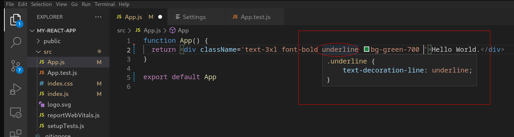

# README

Setting up `tailwindcss` is now easiest: https://tailwindcss.com/docs/guides/create-react-app .

- Motivation: https://youtu.be/pfaSUYaSgRo

- Github code of fireshipio: https://github.com/fireship-io/tailwind-dashboard

```bash
# Some Common classes
text-3xl bg-blue-300 text-black font-bold
text-pink-400
```

## AMZ Images:

***Bcoz images are worth a thousand words!***

- **You can hover any classname in vscode to get the copiled css for any pseudo class like that:**

	

- **How group thing works?**

	*FYI: The `sidebar-tooltip` custom pseudo class has `scale-0` property which makes it hidden (size zero) by default. So on hovering the parent element ( i.e., having class `group`) will make the `sidebar-tooltip` element have `scale-100` i.e., expand to its full size.*

	

- **How you can make your own pseudo classes with layer directive?**

	

- **How any duplicate class added throws compiler error, amazing though:**

	

- **How custom values in Tailwind works?**

	

- **Media queries made easy**: 
